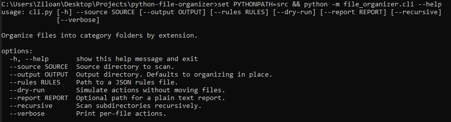
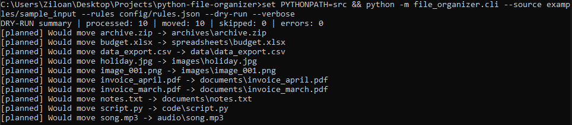

# Python File Organizer


A command-line Python tool that automatically organizes messy folders into clean category-based structures using configurable rules.

This project demonstrates practical Python automation for everyday workflow problems such as sorting downloads, organizing project folders, or cleaning large datasets of mixed files.

---

## Features

* Organize files by extension
* Configurable JSON rule system
* Automatic creation of category folders
* Duplicate-safe renaming (`file_1.ext`, `file_2.ext`)
* Dry-run mode (preview changes safely)
* Optional recursive scanning
* Summary report generation
* Command-line interface (CLI)
* Automated pytest test suite

---

## Project Structure

```
python-file-organizer/
│
├── src/file_organizer/
│   ├── cli.py
│   ├── organizer.py
│   ├── rules.py
│   ├── reporting.py
│   └── utils.py
│
├── config/
│   └── rules.json
│
├── examples/
│   ├── sample_input/
│   ├── before_tree.txt
│   ├── after_tree.txt
│   ├── sample_report.txt
│   ├── terminal_demo.png
│   └── cli_help.png
│
├── tests/
│   ├── test_rules.py
│   ├── test_organizer.py
│   └── test_reporting.py
│
├── scripts/
│   └── run_demo.py
│
├── pyproject.toml
├── requirements.txt
├── requirements-dev.txt
└── README.md
```

---

## Installation

Clone the repository:

```
git clone https://github.com/gregpinke/python-file-organizer.git
cd python-file-organizer
```

Install development dependencies:

```
pip install -r requirements-dev.txt
```

(Optional but recommended)

```
pip install -e .
```

---

## Usage

Basic dry-run example:

```
python -m file_organizer.cli --source examples/sample_input --rules config/rules.json --dry-run --verbose
```

Real run with output folder:

```
python -m file_organizer.cli --source examples/sample_input --output organized_output --rules config/rules.json
```

Generate a report:

```
python -m file_organizer.cli --source examples/sample_input --output organized_output --report report.txt
```

---

## CLI Help



---

## Example Input

```
sample_input/
├── invoice_march.pdf
├── invoice_apil.pdf
├── notes.txt
├── holiday.jpg
├── image_001.png
├── budget.xlsx
├── data_export.csv
├── archive.zip
├── song.mp3
└── script.py
```

---

## Example Output

```
sample_input/
├── documents/
│   ├── invoice_march.pdf
│   ├── invoice_april.pdf
│   └── notes.txt
├── images/
│   ├── holiday.jpg
│   └── image_001.png
├── spreadsheets/
│   └── budget.xlsx
├── data/
│   └── data_export.csv
├── archives/
│   └── archive.zip
├── audio/
│   └── song.mp3
└── code/
    └── script.py
```

---

## Terminal Demo

Example dry-run output:



---

## Configuration

File categorization rules are defined in:

```
config/rules.json
```

Example rule:

```
{
  ".pdf": "documents",
  ".jpg": "images",
  ".csv": "data"
}
```

Extensions are matched case-insensitively.

Unknown extensions are placed in the `others` folder.

---

## Testing

Run the automated tests:

```
pytest
```

Tests cover:

* rule loading
* extension matching
* duplicate-safe renaming
* organizer behavior
* dry-run safety
* report generation

---

## Use Cases

Typical uses for this tool include:

* organizing download folders
* cleaning research datasets
* preparing project directories
* managing media collections
* automating repetitive file management tasks

---

## License

MIT License
